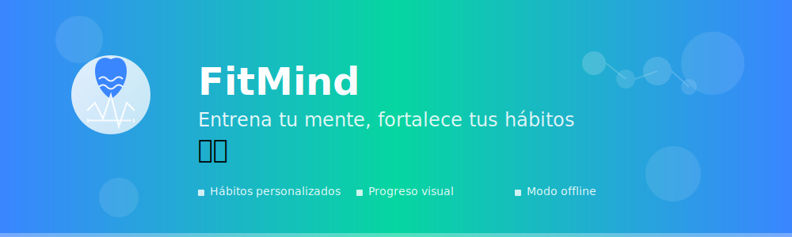

# FitMind 💪🧠

**Entrena tu mente, fortalece tus hábitos**

Una aplicación móvil moderna desarrollada en Kotlin con Jetpack Compose que te ayuda a construir y mantener hábitos saludables para el bienestar mental.

## ✨ Características Principales

- 🏠 **Inicio personalizado** - Dashboard con tus hábitos activos
- 📊 **Gráficos de progreso** - Visualiza tu evolución con datos claros
- ⚙️ **Configuración flexible** - Modo local y Firebase
- 👤 **Modo invitado** - Prueba la app sin registro
- 💾 **Persistencia local** - Funciona sin conexión a internet
- 🎨 **Diseño moderno** - Interfaz fitness con Material 3

## 🎨 Recursos Visuales

### Logo Principal

### Íconos de Navegación
| Inicio | Gráficos | Configuración | Agregar | Invitado |
|--------|----------|---------------|---------|----------|
|  |  |  |  |  |

### Pantalla de Carga

## 🛠️ Tecnologías Utilizadas

- **Kotlin** - Lenguaje de programación principal
- **Jetpack Compose** - UI moderna y declarativa
- **Material 3** - Sistema de diseño actualizado
- **MVVM** - Arquitectura de aplicación
- **Firebase** - Backend y autenticación (opcional)
- **SharedPreferences** - Almacenamiento local
- **Navigation Component** - Navegación entre pantallas

## 🎯 Paleta de Colores

| Color | Código | Uso |
|-------|--------|-----|
| Azul Fit | `#3A86FF` | Color primario, botones principales |
| Verde Fit | `#06D6A0` | Color secundario, éxito, progreso |
| Naranja Fit | `#FF6B35` | Acentos, alertas |
| Gris Suave | `#F5F5F5` | Fondos, elementos neutros |
| Blanco | `#FFFFFF` | Texto sobre colores oscuros |

## 🚀 Instalación

1. Clona el repositorio
2. Abre el proyecto en Android Studio
3. Sincroniza las dependencias de Gradle
4. Ejecuta la aplicación en un dispositivo o emulador

## 📱 Capturas de Pantalla

### Pantalla de Carga
- Animación de logo con barra de progreso
- Transición suave a la pantalla principal

### Pantalla Principal
- Lista de hábitos con cards modernas
- Botón flotante para agregar nuevos hábitos
- Indicador de modo (local/invitado)

### Gráficos
- Visualización de progreso semanal y mensual
- Gráficos de barras y líneas de tendencia
- Mensajes amigables cuando no hay datos

## 🎨 Diseño

El diseño de FitMind sigue los principios de Material 3 con una estética fitness moderna:

- **Tipografía**: Inter/Poppins para legibilidad
- **Iconografía**: Estilo flat con esquinas redondeadas
- **Colores**: Paleta vibrante pero profesional
- **Animaciones**: Transiciones suaves y naturales
- **Espaciado**: Generoso para mejor usabilidad

## 🔧 Configuración

### Modo Local (Sin Firebase)
- Activa el modo local en Configuración
- Los datos se guardan localmente en el dispositivo
- Perfecto para pruebas y desarrollo

### Modo Firebase
- Requiere configuración de Firebase
- Sincronización en la nube
- Autenticación de usuarios

## 📄 Licencia

Este proyecto está bajo la Licencia MIT. Ver el archivo `LICENSE` para más detalles.

## 🤝 Contribuciones

Las contribuciones son bienvenidas. Por favor:

1. Fork el proyecto
2. Crea una rama para tu feature
3. Commit tus cambios
4. Push a la rama
5. Abre un Pull Request

## 📞 Contacto

Para preguntas o sugerencias, abre un issue en GitHub.

---

**FitMind** - Transformando vidas, un hábito a la vez 🧘‍♂️✨
